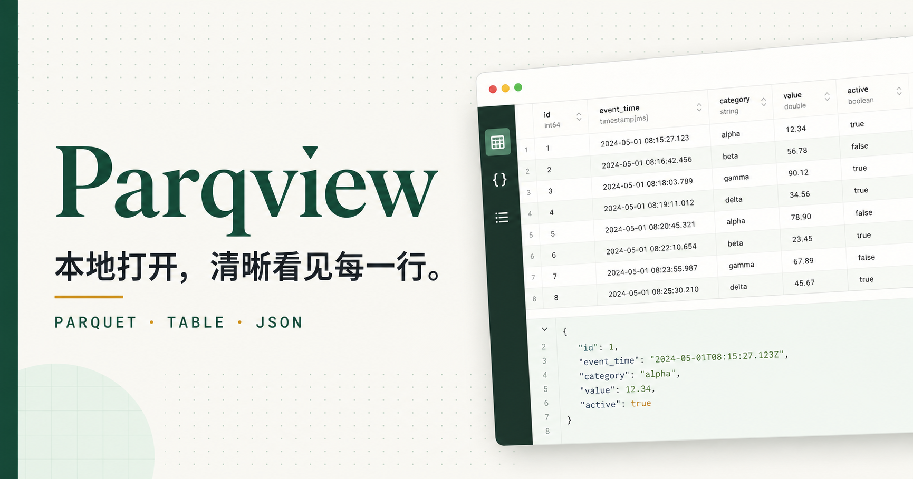

<p align="right">
  <strong>简体中文</strong> · <a href="./README.en.md">English</a>
</p>

<p align="center">
  
</p>

# Parqview

Parqview 是一个基于 Tauri 2 的跨平台 Parquet 文件浏览器。文件在本机解析，
无需上传到服务器。

## 功能

- 表格、直接展示和 JSON 三种视图
- 全数据集搜索、字段筛选与关键词高亮
- 表格多行分页；直接展示和 JSON 每页一条记录
- 可输入页码，表格支持 25 / 50 / 100 行分页
- 直接展示按字段折叠，JSON 使用 2 空格缩进
- 主题、深色模式、中英文、字体系列和字号设置
- 支持 Snappy、GZIP、ZSTD、Brotli、LZ4 等常见压缩格式
- 完全离线，数据仅保留在当前设备

## 支持平台

| 平台 | 构建产物 |
| --- | --- |
| Windows 10/11 x64 | NSIS 安装程序 |
| macOS Apple Silicon / Intel | DMG |
| Linux x64 | Debian 包、AppImage |

## 开发

### 环境要求

- Node.js 22+
- Rust stable
- 当前系统对应的 [Tauri 构建依赖](https://v2.tauri.app/start/prerequisites/)

```bash
npm install
npm run tauri:dev
```

只启动浏览器前端：

```bash
npm run dev
```

## 检查与构建

```bash
npm run lint
npm test
npm run tauri:build
```

前端输出位于 `dist/`，原生安装包位于
`src-tauri/target/release/bundle/`。

推送 `v*` 标签或手动运行
[`Build Tauri`](./.github/workflows/tauri-build.yml)，可构建 Windows、macOS
和 Linux 安装包。

## 项目结构

```text
frontend/        React 界面与 Parquet 解析逻辑
src-tauri/       Rust 宿主、权限、图标和打包配置
tests/           前端与 Tauri 配置测试
docs/            仓库文档资源
assets/          可编辑的应用图标源文件
```

## 隐私

Parquet 文件由 WebView 内的 `hyparquet` 直接读取。应用不包含上传接口，
也不会将文件内容发送到外部服务。

## 贡献

提交前请阅读 [CONTRIBUTING.md](./CONTRIBUTING.md)。安全问题请参阅
[SECURITY.md](./SECURITY.md)。

## 许可证

[MIT](./LICENSE)
